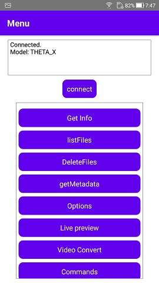
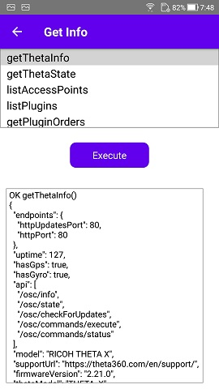
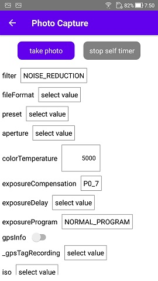

# THETA Client

[](https://github.com/ricohapi/theta-client/actions/workflows/buildAndTest.yaml)
[](https://ricohapi.github.io/theta-client/)

[](https://kotlinlang.org)
[](https://kotlinlang.org)
[](https://ricohapi.github.io/theta-client/)
[](https://ricohapi.github.io/theta-client/)


This library provides a way to control RICOH THETA using [RICOH THETA API v2.1](https://github.com/ricohapi/theta-api-specs/tree/main/theta-web-api-v2.1).
Your app can perform the following actions:
* Take a photo and video
* Acquire a list of photos and videos
* Acquire a JPEG file and MP4 file
* Acquire the status of THETA
* Acquire and set properties of THETA

## Supported Environments
* Android native (Kotlin)
* iOS native (Swift)
* React Native
* Flutter

## Supported Models
* THETA X
* THETA Z1
* THETA V
* THETA SC
* THETA S (firmware version 01.62 or later)

## Directory Structure
* theta-client
  * demos: Demo applications
  * docs: Documentation
  * kotlin-multiplatform: Library body ([Kotlin Multiplatform Mobile](https://kotlinlang.org/docs/multiplatform-mobile-getting-started.html))
  * react-native: React Native package
  * flutter: Flutter plugin

## Build

### Android (aar)
```
theta-client$ ./gradlew publishToMavenLocal
```

aar is output to `theta-client/kotlin-multiplatform/build/outputs/aar`

### iOS (XCFramework)
```
theta-client$ ./gradlew podPublishXCFramework
```

XCFramework is output to `theta-client/kotlin-multiplatform/build/cocoapods/publish`

### ReactNative & Flutter
See README in each directory.(`react-native`, `flutter`)

### Test
```
theta-client$ ./gradlew testReleaseUnitTest
```

## How to Use
See tutorials in `docs` directory and [API reference](https://ricohapi.github.io/theta-client/) of this library.
Demo applications in `demos` directory may help you understand how to use this library.

## Verification tool
A tool, written in React Native, is prepared to verify the responses and behavior of Theta to verious requests.
Using this verification tool, you can select and send a command with its parameters then its response is displayed in JSON converted from Android or iOS object.





## License

[MIT License](LICENSE)

## Useful guides
* [THETA SDK docs | help](https://theta360developers.github.io/sdk/)
